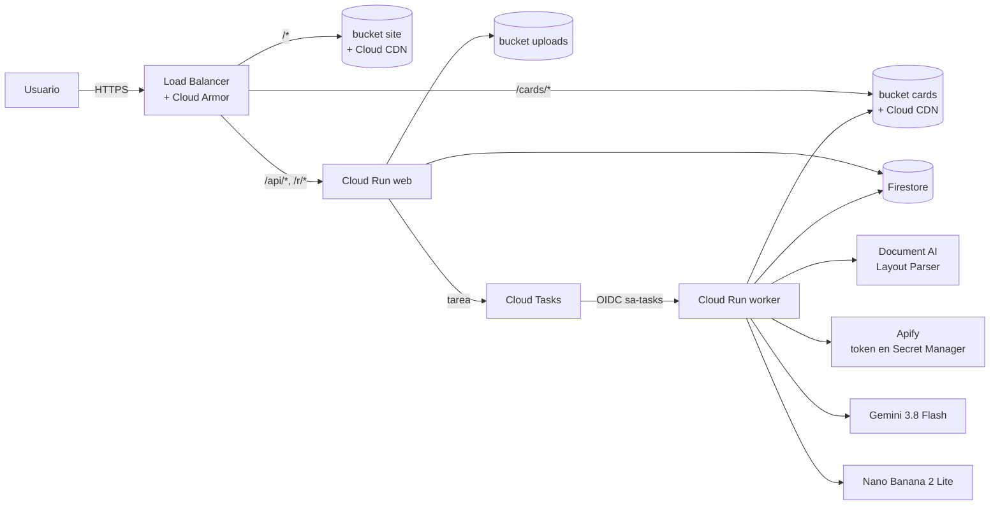

# Roastfolio

App web que "roastea" un perfil profesional con humor y devuelve consejos reales. Subes tu CV en PDF (o pegas la URL de tu perfil de LinkedIn), eliges la intensidad y en menos de un minuto recibes un titular, un roast, una calificación del 1 al 10, tres consejos accionables y un certificado compartible generado con Nano Banana. Todo se borra a las 24 horas.

Es la demo de arquitectura del curso de Cloud: cada pieza usa un servicio distinto de Google Cloud y cada servicio tiene su artículo.

**En vivo:** https://34.117.137.57.nip.io

## Arquitectura



**Flujo:** el frontend (React estático en `site`) envía el PDF o la URL a `POST /api/roasts`. **web** valida, guarda el PDF en `uploads`, crea `roasts/{id}` en Firestore con estado `queued` y encola una tarea. Cloud Tasks llama al **worker** (privado, solo tráfico interno, autenticado con OIDC). El worker extrae el texto (Document AI o Apify), lo normaliza con Gemini, escribe el roast con salida JSON estructurada, genera el certificado con Nano Banana, lo convierte a JPEG 1200×630 y lo sube a `cards`. El frontend consulta `GET /api/roasts/{id}` cada 2 s y muestra el roast en cuanto existe, antes de que termine la tarjeta. `/r/{id}` devuelve el mismo `index.html` del sitio con meta tags Open Graph, así el link compartido muestra la tarjeta como vista previa.

**Estados:** `queued → extracting → roasting → rendering → done | failed`. Cada paso guarda su resultado antes de avanzar: si Cloud Tasks reintenta, el worker retoma donde se quedó y no vuelve a pagar Document AI ni Gemini.

## Servicios (13)

| # | Servicio | Uso |
|---|----------|-----|
| 1 | Cloud Run | `roastfolio-web` (API + `/r/{id}`) y `roastfolio-worker` (pipeline) |
| 2 | Cloud Storage | `site` (público), `uploads` (privado, lifecycle 1 día), `cards` (público, lifecycle 1 día) |
| 3 | Document AI | Layout Parser en `us`: PDF → texto estructurado |
| 4 | Gemini en Vertex AI | `gemini-3.8-flash` (perfil + roast con JSON schema) y `gemini-3.1-flash-lite-image` (certificado 16:9) |
| 5 | Cloud Tasks | Cola `roasts`: 5 en paralelo, 4 intentos con backoff |
| 6 | Firestore | Base `roastfolio`, colección `roasts`, TTL sobre `expiresAt` |
| 7 | Cloud Load Balancing | HTTPS global, ruteo por path, certificado administrado para `<IP>.nip.io` |
| 8 | Cloud CDN | Caché de `site` (según `Cache-Control`) y de `cards` (máx. 1 h) |
| 9 | Cloud Armor | OWASP (sensibilidad 1) + 5 `POST /api/roasts` por IP cada 10 min |
| 10 | IAM | `sa-web`, `sa-worker`, `sa-tasks`, `sa-build` con permisos mínimos |
| 11 | Cloud Build + Artifact Registry | CI/CD en push a `main` (trigger de Cloud Build conectado a GitHub), imágenes con política de limpieza |
| 12 | Cloud Logging / Monitoring | Logs JSON, métricas basadas en logs, alerta y dashboard |
| 13 | Secret Manager | Token de Apify, única llave del sistema; solo `sa-worker` lo lee |

## Cambios respecto al spec original

- **LinkedIn por Apify en vez de Playwright.** Desde IPs de GCP LinkedIn casi siempre responde con el authwall. El actor `harvestapi/linkedin-profile-scraper` no usa cookies y cuesta unos $4 por 1,000 perfiles. Por eso aparece Secret Manager como servicio 13. Además se pide confirmar "es mi perfil o tengo permiso".
- **Vertex AI en `global`** para los modelos de Gemini; el resto en `us-central1`.
- **Permisos que faltaban:** `sa-web` necesita `iam.serviceAccountUser` sobre `sa-tasks` para crear tareas con OIDC, y `sa-build` necesita `actAs` sobre `sa-web` y `sa-worker`.
- **Expiración lógica.** El TTL de Firestore y el lifecycle de Storage borran de forma asíncrona (puede tardar hasta un día más), así que la API trata `expiresAt < ahora` como expirado.
- **Tarjeta como JPEG 1200×630 de menos de 300 KB**, porque WhatsApp y otras redes ignoran imágenes pesadas. Se guarda como `{id}.jpg`.
- **El WAF no revisa `POST /api/roasts`**, porque el PDF binario genera falsos positivos. Esa ruta queda protegida por la validación estricta de la app y el rate limit.
- **Worker con ingress `internal`:** ni siquiera es alcanzable desde internet, solo desde Cloud Tasks.

## Estructura

```
roastfolio/
├── frontend/          React + Vite + Tailwind (UI en español), vitest
├── web/               FastAPI: POST/GET /api/roasts, GET /r/{id}; pytest
├── worker/            FastAPI: POST /internal/process (pipeline); pytest
├── infra/             scripts gcloud numerados (01 → 14) + env.sh
└── cloudbuild.yaml    tests → imágenes → Cloud Run → bucket site (trigger en push a main)
```

## Desarrollo local

Sin GCP: `LOCAL_MODE=1` cambia Firestore y Storage por archivos en `.localdata/`, y `MOCK_AI=1` reemplaza Document AI, Apify y Gemini por respuestas fijas.

```bash
# terminal 1: worker
cd worker && LOCAL_MODE=1 MOCK_AI=1 LOCAL_DATA_DIR=../.localdata uv run uvicorn app.main:app --port 8081
# terminal 2: web
cd web && LOCAL_MODE=1 LOCAL_DATA_DIR=../.localdata WORKER_URL=http://localhost:8081 uv run uvicorn app.main:app --port 8080
# terminal 3: frontend (proxy de /api y /cards hacia :8080)
cd frontend && npm install && npm run dev
```

Con IA real y sin mocks, quita `MOCK_AI` del worker (usa tus credenciales ADC para Vertex).

Tests:

```bash
(cd web && uv run pytest) && (cd worker && uv run pytest) && (cd frontend && npm test)
```

## Despliegue desde cero

Requisitos: `gcloud` autenticado con permisos de owner en el proyecto y un token de Apify.

```bash
printf '%s' 'apify_api_...' | gcloud secrets create apify-token --data-file=- --replication-policy=automatic
for s in infra/0*.sh infra/1[0-2]*.sh; do bash "$s"; done
bash infra/13-build-trigger.sh  # CI/CD: trigger de Cloud Build conectado a GitHub
```

**CI/CD.** Cada push a `main` dispara el trigger `roastfolio-main` de Cloud Build, que corre `cloudbuild.yaml` como `sa-build`. El trigger usa una conexión de Cloud Build a GitHub (2nd gen, `rf-github`). La primera vez, `13-build-trigger.sh` imprime un link para autorizar la GitHub App de Cloud Build e instalarla en el repo; después hay que volver a correr el script. El token de GitHub de la conexión lo guarda Cloud Build en Secret Manager. Historial y logs de cada build: consola de Cloud Build → Historial.

| Script | Qué hace |
|--------|----------|
| `01-apis.sh` | Habilita las APIs |
| `02-iam.sh` | Cuentas de servicio y roles a nivel proyecto |
| `03-storage.sh` | Buckets, lifecycle y permisos por bucket |
| `04-firestore.sh` | Base `roastfolio` + política TTL |
| `05-documentai.sh` | Procesador Layout Parser |
| `06-tasks.sh` | Cola `roasts` + permiso de encolar para `sa-web` |
| `07-secrets.sh` | Acceso de `sa-worker` al token de Apify |
| `08-artifact-registry.sh` | Repositorio Docker con limpieza automática |
| `09-run.sh` | Primer despliegue de web y worker con toda su configuración |
| `10-lb.sh` | IP, NEG, backends, CDN, URL map, certificado, HTTPS y redirect |
| `11-armor.sh` | Reglas OWASP y rate limits |
| `12-observability.sh` | Métricas, alerta por correo y dashboard |
| `13-build-trigger.sh` | Conexión a GitHub + trigger de Cloud Build en push a `main` |
| `14-github-actions.sh` | (Alternativa, sin uso) Workload Identity Federation para disparar Cloud Build desde GitHub Actions |

Los scripts son idempotentes: se pueden correr otra vez sin romper nada. La configuración de runtime (variables, cuentas de servicio, ingress) vive en `09-run.sh`; Cloud Build solo cambia la imagen.

## Verificación rápida

```bash
B=https://34.117.137.57.nip.io
curl -s $B/api/health                                              # {"ok":true}
curl -s -F intensity=medium -F consent=true -F pdf=@cv.pdf $B/api/roasts   # {"id": "..."}
curl -s $B/api/roasts/<id>                                          # estado y resultado
curl -sI $B/cards/<id>.jpg | grep -i age                            # segunda vez: cache hit del CDN
curl -s -o /dev/null -w "%{http_code}\n" https://roastfolio-web-611681112050.us-central1.run.app/api/health  # 404: solo vía LB
```

## Costos estimados (1,000 roasts al mes)

| Concepto | USD/mes aprox. |
|----------|---------------:|
| Load Balancer (regla de forwarding) | 18 |
| Cloud Armor (política + 10 reglas + requests) | 15 |
| Nano Banana 2 Lite (1 imagen por roast, $0.034) | 34 |
| Document AI Layout Parser ($10 por 1,000 páginas, ~2 por CV) | 10–20 |
| Gemini 3.8 Flash (2 llamadas por roast) | 2–5 |
| Apify (solo roasts por URL, $4 por 1,000) | ≤ 4 |
| Cloud Run, Firestore, Storage, Tasks, Build, Logging | ~0 (capa gratuita) |
| **Total** | **~85–95** |

Los fijos dominan con poco tráfico. Cifras a validar con la [calculadora de precios](https://cloud.google.com/products/calculator).
