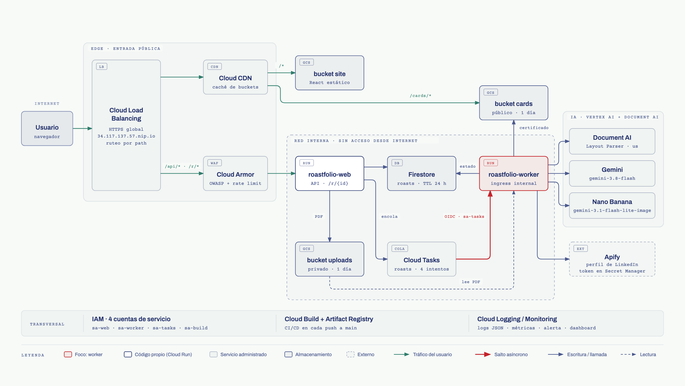
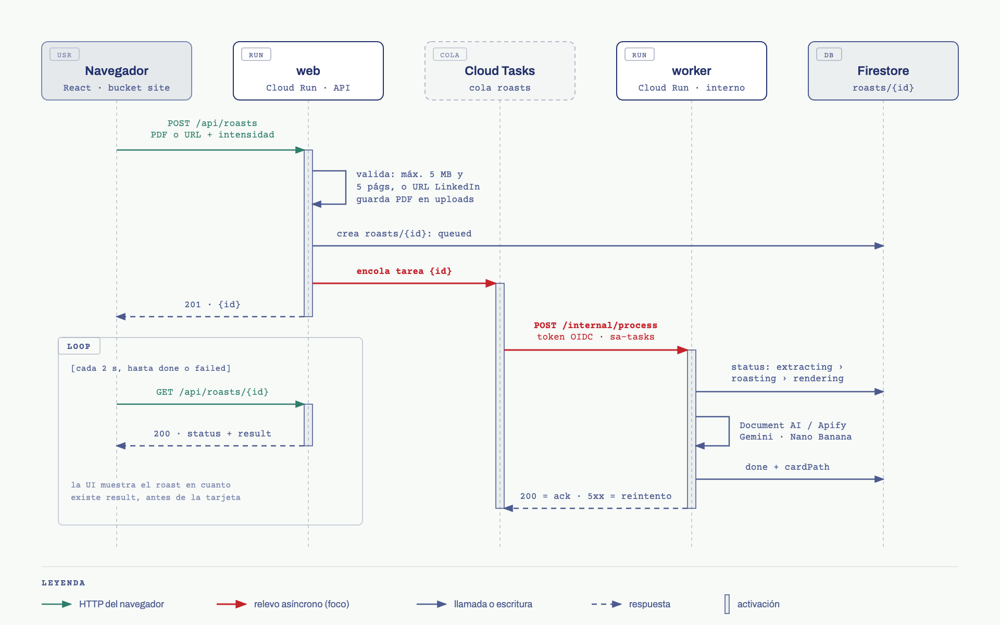
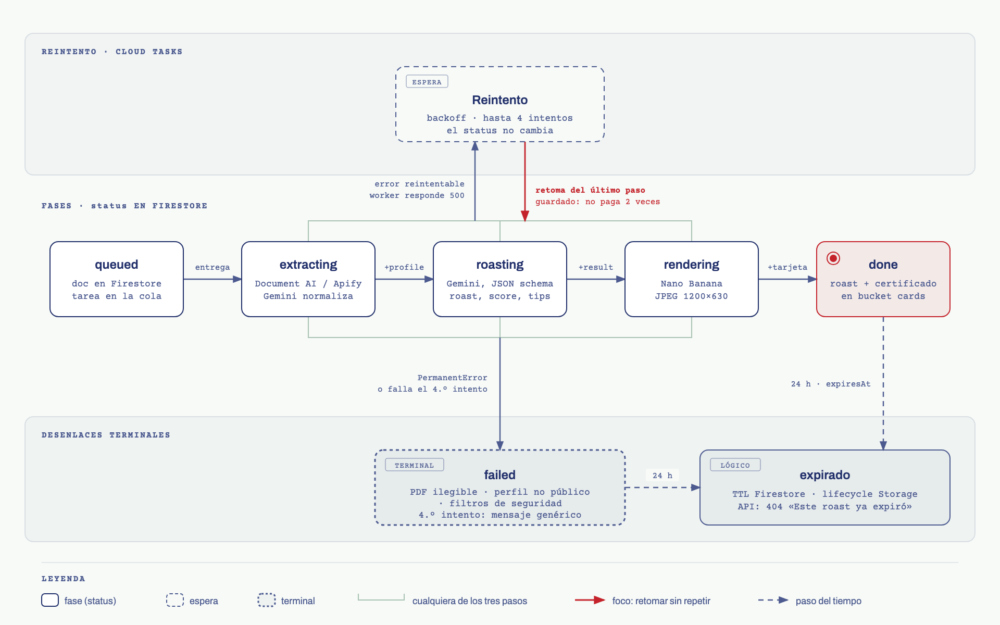
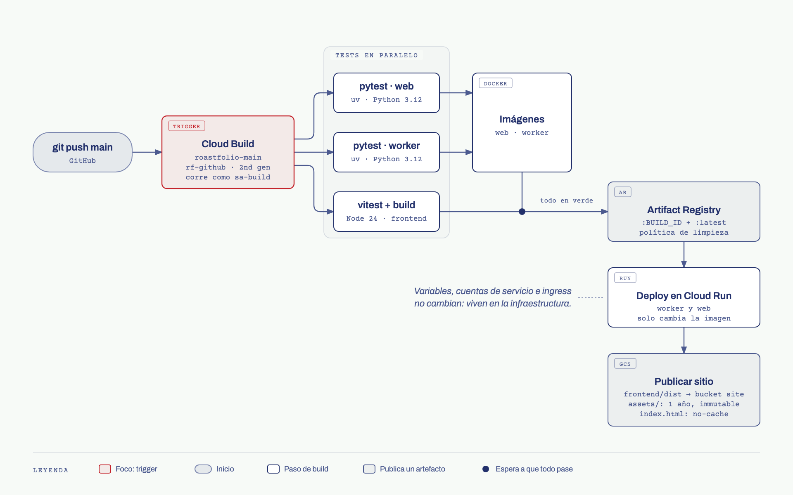

# Roastfolio

Subes tu CV en PDF o pegas la URL de tu perfil de LinkedIn, eliges qué tan duro quieres que te traten y en menos de un minuto recibes:

- un titular;
- un roast con humor;
- una calificación del 1 al 10;
- tres consejos que sí sirven;
- un certificado oficial de roast, generado con Nano Banana, listo para compartir.

A las 24 horas todo se borra solo.

Es la demo de arquitectura del curso de Cloud: una app pequeña, pero con los problemas de una app real. Recibe tráfico que se comparte, hace llamadas caras a modelos de IA, procesa en segundo plano, maneja datos personales que no deben quedarse y necesita un deploy automático. Cada problema se resuelve con un servicio de Google Cloud; en total son 13.

**En vivo:** https://34.117.137.57.nip.io

| Documento | Para qué |
|---|---|
| [Guía de onboarding](docs/ONBOARDING.md) | Correr la app en local, entender el código y hacer tu primer cambio |
| [Costos](docs/COSTOS.md) | Estimación mensual por servicio con precios de lista y consumo medido |
| [Terraform](terraform/README.md) | La infraestructura como código: adoptar lo existente o crear todo desde cero |
| [Diagramas](docs/diagramas/) | Fuentes HTML y exportaciones SVG/PNG de los diagramas de este README |

## Contenido

1. [Qué hace](#qué-hace)
2. [Arquitectura](#arquitectura)
3. [Servicios](#servicios)
4. [Seguridad](#seguridad)
5. [Costos](#costos)
6. [Despliegue](#despliegue)
7. [Progreso del proyecto](#progreso-del-proyecto)
8. [Estructura del repo](#estructura-del-repo)

## Qué hace

1. Entras a la landing y subes un PDF (máximo 5 MB y 5 páginas) o pegas la URL de un perfil de LinkedIn. Si es URL, confirmas que es tu perfil o que tienes permiso.
2. Eliges la intensidad: **suave**, **medio** o **brutal**.
3. Ves el avance en vivo: *extrayendo → roasteando → generando certificado*.
4. Lees el roast apenas existe, sin esperar la imagen.
5. Compartes el link `/r/{id}`: en WhatsApp, LinkedIn o X la vista previa es tu certificado.

El modelo se burla solo de lo profesional: buzzwords, títulos inflados, cargos de tres meses. Nunca de la apariencia, la edad, el género, el origen o el nombre. La calificación no depende de la intensidad: un perfil de 7 sigue siendo de 7 aunque pidas que lo destrocen.

No hay cuentas, login, historial ni pagos.

## Arquitectura



Todo entra por **un solo Load Balancer HTTPS global**, protegido con Cloud Armor. El URL map decide por path:

| Path | Destino | Caché |
|---|---|---|
| `/api/*`, `/r/*` | Cloud Run `roastfolio-web` (serverless NEG) | no |
| `/cards/*` | bucket `cards` (backend bucket) | Cloud CDN, máximo 1 hora |
| todo lo demás | bucket `site`, el build de React (backend bucket) | Cloud CDN según `Cache-Control`: assets con hash 1 año, `index.html` sin caché |

El puerto 80 solo redirige a HTTPS. El dominio es `<IP>.nip.io`: un DNS comodín público que resuelve a la IP del Load Balancer. Gracias a él, el certificado administrado de Google se emite sin comprar un dominio.

### El recorrido de un roast



1. **`web`** recibe `POST /api/roasts`, valida la entrada, guarda el PDF en el bucket privado `uploads`, crea `roasts/{id}` en Firestore con estado `queued` y encola una tarea en Cloud Tasks. Responde con el `id` en menos de un segundo. Nada pesado pasa en esa solicitud.
2. **Cloud Tasks** llama a `roastfolio-worker` con un token OIDC de `sa-tasks`. Tiene 5 envíos en paralelo, 2 por segundo y 4 intentos con backoff de 10 a 120 s. El límite de concurrencia protege las cuotas de Vertex AI cuando llega un pico.
3. **`worker`** hace el trabajo pesado:
   - extrae el texto con Document AI (PDF) o con Apify (LinkedIn);
   - escribe el roast con `gemini-3.8-flash` y un JSON schema fijo;
   - genera el certificado con Nano Banana (`gemini-3.1-flash-lite-image`) y lo convierte a JPEG de 1200×630 y menos de 300 KB;
   - lo sube a `cards`.
4. **El navegador** consulta `GET /api/roasts/{id}` cada 2 segundos y muestra cada avance.
5. **`/r/{id}`** devuelve el `index.html` del sitio con meta tags Open Graph que apuntan al certificado. Por eso el link compartido tiene vista previa.

### Estados y reintentos



Firestore guarda cada roast como una máquina de estados: `queued → extracting → roasting → rendering → done | failed`.

**Cada paso guarda su resultado antes de avanzar.** Si el worker se cae a media ejecución, Cloud Tasks reintenta y el worker retoma desde el último paso guardado, sin volver a pagar Document AI ni Gemini.

Los errores se separan en dos grupos:

- **Permanentes:** PDF ilegible, perfil privado, contenido bloqueado por los filtros de seguridad. Pasan directo a `failed` con un mensaje claro, porque reintentar no los arregla.
- **Pasajeros:** un 503 de Vertex, un timeout. Se reintentan, y solo en el último intento el roast pasa a `failed`.

**Expiración.** Todo roast tiene `expiresAt = creación + 24 h`. Una política TTL de Firestore borra el documento, y el lifecycle de `uploads` y `cards` borra los archivos. Esos borrados son asíncronos y pueden tardar hasta un día más, así que la API trata como expirado cualquier roast con `expiresAt` en el pasado, exista o no el documento.

## Servicios

| # | Servicio | Rol en Roastfolio | Cómo se integra |
|---|---|---|---|
| 1 | **Cloud Run** | Cómputo de `roastfolio-web` (API y páginas `/r/{id}`) y `roastfolio-worker` (pipeline) | Web: 512 MiB, 40 requests por instancia, ingress `internal-and-cloud-load-balancing`. Worker: 1 GiB, 4 por instancia, ingress `internal`. Ambos escalan de 0 a 5 |
| 2 | **Cloud Storage** | `site` (frontend), `uploads` (PDFs) y `cards` (certificados) | `site` y `cards` son públicos solo como backend buckets del LB. `uploads` es privado, con *public access prevention*. `uploads` y `cards` borran objetos de más de 1 día |
| 3 | **Firestore** | Estado y resultado de cada roast | Base `roastfolio`, colección `roasts`, política TTL sobre `expiresAt` |
| 4 | **Cloud Tasks** | Cola del pipeline | Cola `roasts`: tareas HTTP con OIDC hacia el worker, concurrencia 5 y 4 intentos |
| 5 | **Document AI** | PDF → texto con estructura | Procesador Layout Parser en la multirregión `us` |
| 6 | **Vertex AI (Gemini)** | Roast con salida JSON (directo del texto extraído) y certificado con Nano Banana | `gemini-3.8-flash` y `gemini-3.1-flash-lite-image`, endpoint `global` |
| 7 | **Cloud Load Balancing** | Entrada única HTTPS | IP global, URL map por path, certificado administrado para `<IP>.nip.io`, redirect 80 → 443 |
| 8 | **Cloud CDN** | Caché del frontend y de los certificados | Activado en los backend buckets `site` y `cards` |
| 9 | **Cloud Armor** | WAF y rate limiting | Política `rf-armor` en el backend de web: 8 reglas OWASP y 2 límites por IP |
| 10 | **IAM** | Una identidad por componente | `sa-web`, `sa-worker`, `sa-tasks` y `sa-build`, con roles sobre el recurso concreto ([detalle](#identidades-y-permisos)) |
| 11 | **Cloud Build + Artifact Registry** | CI/CD e imágenes | Trigger en push a `main` conectado a GitHub. Repositorio Docker con política de limpieza |
| 12 | **Cloud Logging + Monitoring** | Observabilidad | Logs JSON, 4 métricas basadas en logs, alerta por tasa de error y dashboard |
| 13 | **Secret Manager** | La única llave del sistema | Secreto `apify-token`: solo `sa-worker` lo puede leer. El worker lo pide a Secret Manager la primera vez que lo necesita; nunca es una variable de entorno |

Fuera de GCP solo está **Apify**, un actor de scraping que devuelve el perfil público de LinkedIn. Desde IPs de GCP, LinkedIn responde casi siempre con su pantalla de login, y Apify resuelve eso sin cookies.

### Observabilidad

- **Logs JSON a stdout** con `roastId`, `step`, `event` y `durationMs`. Filtrar por `roastId` muestra la historia completa de un roast.
- **Métricas basadas en logs:**
  - roasts encolados, terminados y fallidos (`event` = `roast_queued`, `roast_done`, `roast_failed`);
  - duración por paso (`step_finished`, distribución).
- **Alerta** por correo cuando fallan más del 10 % de los roasts en 15 minutos (solo con 5 roasts o más en la ventana, para que uno solo no dispare la alarma).
- **Dashboard "Roastfolio"** con roasts por hora, latencia p95 por paso y cache hit ratio del CDN.

## Seguridad

### Perímetro

- **Una sola puerta.** `roastfolio-web` tiene ingress `internal-and-cloud-load-balancing`: su URL `*.run.app` responde 404 desde internet y solo acepta tráfico que llega por el Load Balancer. `roastfolio-worker` tiene ingress `internal`: ni siquiera el Load Balancer lo alcanza, solo Cloud Tasks.
- **HTTPS siempre.** El certificado es administrado por Google y el puerto 80 solo redirige.
- **Cloud Armor** en el backend de web:

| Prioridad | Regla | Acción |
|---|---|---|
| 1000–1070 | OWASP CRS 3.3 con sensibilidad 1: SQLi, XSS, LFI, RFI, RCE, method enforcement, scanner detection, protocol attack | 403 |
| 2000 | Más de 5 `POST /api/roasts` por IP en 10 minutos | 429 |
| 2100 | Más de 300 requests por IP en 1 minuto | 429 |

El WAF no inspecciona `POST /api/roasts`, porque el cuerpo es un PDF binario y las firmas de inyección dan falsos positivos con bytes aleatorios. Esa ruta la cubren el rate limit más estricto y la validación de la app.

### Identidades y permisos

Ninguna identidad usa llaves JSON. Cada servicio corre con su propia service account, y los roles se dan sobre el recurso concreto siempre que GCP lo permite.

| Service account | Qué puede hacer | Dónde |
|---|---|---|
| `sa-web` | Crear objetos (no leer ni borrar) | bucket `uploads` |
| | Leer y escribir documentos | Firestore (proyecto) |
| | Encolar tareas | cola `roasts` |
| | Firmar tokens OIDC como `sa-tasks` (`serviceAccountUser`) | `sa-tasks` |
| `sa-worker` | Leer PDFs | bucket `uploads` |
| | Escribir certificados | bucket `cards` |
| | Leer y escribir documentos | Firestore (proyecto) |
| | Usar Document AI y Vertex AI | proyecto |
| | Leer el token de Apify | secreto `apify-token` |
| `sa-tasks` | Invocar el worker (`run.invoker`), y nada más | servicio `roastfolio-worker` |
| `sa-build` | Desplegar revisiones (`run.developer`) | servicios `roastfolio-web` y `roastfolio-worker` |
| | Subir imágenes | repositorio `roastfolio` de Artifact Registry |
| | Publicar el frontend | bucket `site` |
| | Desplegar revisiones que corren como `sa-web` y `sa-worker` | esas dos service accounts |
| | Escribir logs del build | proyecto |

El agente de servicio de Cloud Build solo puede **leer** el secreto que guarda el token de la conexión con GitHub. Durante la autorización inicial necesita crear ese secreto, así que recibe permisos de administrador solo mientras dura ese paso.

### Datos

- **Todo expira a las 24 horas**, por TTL en Firestore, lifecycle en Storage y expiración lógica en la API.
- **Los PDFs nunca son públicos.** Solo `sa-web` los escribe y solo `sa-worker` los lee.
- **Los certificados son públicos a propósito** (son la vista previa del link), pero sus nombres son el `id` del roast: 22 caracteres aleatorios (128 bits), imposibles de adivinar. `allUsers` tiene `storage.legacyObjectReader` (leer un objeto por su nombre) y no `storage.objectViewer`, que además permitiría listar el bucket y descubrir todos los ids.

### Entradas y modelos

- **Validación estricta en `web`:**
  - PDF de 5 MB o menos, que empiece con `%PDF`, que no esté cifrado y que tenga 5 páginas o menos;
  - URL que calce con un perfil `linkedin.com/in/…`. La app reconstruye la URL desde el nombre de usuario, así que nunca se llama a un host que mande el usuario.
- **El CV es dato, no instrucción.** El texto del perfil va delimitado en el prompt, con la indicación explícita de ignorar cualquier instrucción que traiga.
- **Los campos del certificado se limpian** (sin comillas, llaves ni saltos de línea) antes de entrar al prompt de la imagen.
- **Filtros de seguridad.** Si el modelo bloquea el roast o el certificado, el roast falla con un mensaje claro y no se reintenta.
- **Límites que el modelo no puede romper.** La salida se recorta en código: nombre ≤ 25 caracteres, titular ≤ 8 palabras, apertura ≤ 90 palabras, 3 a 5 observaciones que citan el perfil, calificación entre 1 y 10, exactamente 3 consejos con "antes" y "después".
- **Consentimiento.** Para roastear una URL de LinkedIn hay que confirmar que es tu perfil o que tienes permiso.

### Riesgos conocidos

- Cloud Armor protege el backend de web, pero no los backend buckets `site` y `cards`: ahí solo hay contenido estático y público, servido desde el CDN. El siguiente paso sería una *edge security policy* para esos dos.
- El rate limit es por IP. Alguien con muchas IPs puede generar más roasts, y cada uno cuesta unos 8 centavos. La alerta y el dashboard existen para ver algo así a tiempo.

## Costos

Con precios de lista del 28 de septiembre de 2026 y consumo medido en producción:

| Escenario | USD al mes |
|---|---:|
| Sin tráfico: solo el piso fijo (Load Balancer y Cloud Armor) | **33** |
| 1,000 roasts | **115** |
| 10,000 roasts | **866** |

- **Un roast cuesta unos 8 centavos:** $0.034 de Nano Banana, $0.032 de Gemini (la mayoría son tokens de razonamiento) y $0.014 de Document AI.
- Cloud Run, Firestore, Storage, Tasks, Build y Logging caben en la capa gratuita con 1,000 roasts.
- Con 10,000 roasts, la IA es el 94 % de la factura.

El detalle por servicio con fórmulas, los datos para reproducirlo en la [calculadora de precios](https://cloud.google.com/products/calculator) y cómo bajarlo a unos 3 centavos por roast están en **[docs/COSTOS.md](docs/COSTOS.md)**.

## Despliegue

### Desarrollo local

No necesitas GCP. `LOCAL_MODE=1` cambia Firestore y Storage por archivos locales, y `MOCK_AI=1` reemplaza Document AI, Apify, Gemini y Nano Banana por respuestas fijas.

```bash
cd worker && LOCAL_MODE=1 MOCK_AI=1 LOCAL_DATA_DIR=../.localdata uv run uvicorn app.main:app --port 8081
cd web && LOCAL_MODE=1 LOCAL_DATA_DIR=../.localdata WORKER_URL=http://localhost:8081 uv run uvicorn app.main:app --port 8080
cd frontend && npm install && npm run dev
```

Tests (los mismos que corre el pipeline):

```bash
(cd web && uv run pytest) && (cd worker && uv run pytest) && (cd frontend && npm test)
```

El paso a paso completo está en la [guía de onboarding](docs/ONBOARDING.md).

### Despliegue desde cero

Necesitas `gcloud` autenticado con permisos de owner en el proyecto y un token de Apify. La infraestructura se puede levantar de dos maneras equivalentes:

- **Scripts `gcloud`** (`infra/`): imperativos, uno por servicio y en orden. Son los que se usan en clase para ver cada pieza.
- **Terraform** (`terraform/`): declarativo, con `plan` antes de cada cambio. Ver [terraform/README.md](terraform/README.md).

Con los scripts:

```bash
# 1. Proyecto y región: edita PROJECT_ID, REGION y ALERT_EMAIL en infra/env.sh

# 2. El token de Apify entra directo a Secret Manager, sin pasar por ningún archivo
printf '%s' 'apify_api_...' | gcloud secrets create apify-token --data-file=- --replication-policy=automatic

# 3. Infraestructura, en orden
for s in infra/0*.sh infra/1[0-2]*.sh; do bash "$s"; done

# 4. CI/CD: imprime un link para autorizar GitHub; autoriza y vuelve a correrlo
bash infra/13-build-trigger.sh
bash infra/13-build-trigger.sh
```

| Script | Qué hace |
|---|---|
| `01-apis.sh` | Habilita las APIs |
| `02-iam.sh` | Crea las cuatro service accounts, los roles de proyecto y los permisos `actAs` |
| `03-storage.sh` | Crea los buckets `site`, `uploads` y `cards` con su lifecycle y permisos |
| `04-firestore.sh` | Crea la base `roastfolio` y la política TTL |
| `05-documentai.sh` | Crea el procesador Layout Parser |
| `06-tasks.sh` | Crea la cola `roasts` y el permiso de encolar para `sa-web` |
| `07-secrets.sh` | Da a `sa-worker` acceso al token de Apify |
| `08-artifact-registry.sh` | Crea el repositorio Docker con limpieza automática |
| `09-run.sh` | Hace el primer build y deploy de web y worker con toda su configuración de runtime, e invoker y deployer por servicio |
| `10-lb.sh` | Configura IP, NEG, backends, CDN, URL map, certificado, proxy HTTPS y redirect |
| `11-armor.sh` | Aplica las reglas OWASP y los rate limits |
| `12-observability.sh` | Crea las métricas, la alerta por correo y el dashboard |
| `13-build-trigger.sh` | Conecta GitHub y crea el trigger de Cloud Build |

Todos los scripts son idempotentes: puedes correrlos otra vez sin romper nada.

El certificado tarda entre 15 y 60 minutos en quedar `ACTIVE` la primera vez.

### CI/CD



Cada push a `main` dispara el trigger `roastfolio-main`, que corre `cloudbuild.yaml` como `sa-build`:

1. Los tests de web, worker y frontend, en paralelo.
2. El build de las imágenes, que se suben a Artifact Registry.
3. El deploy de las nuevas revisiones en Cloud Run.
4. La publicación del frontend en el bucket `site`.

Si un test falla, no se despliega nada.

El pipeline solo cambia la **imagen** de cada servicio. Las variables de entorno, la service account, el ingress y los límites viven en `infra/09-run.sh` y `terraform/run.tf`, así que un push no puede cambiar permisos ni configuración sin pasar por la revisión de infra.

### Verificación rápida

```bash
B=https://34.117.137.57.nip.io
curl -s $B/api/health                                                      # {"ok":true}
curl -s -F intensity=medium -F consent=true -F pdf=@cv.pdf $B/api/roasts   # {"id":"..."}
curl -s $B/api/roasts/<id>                                                 # estado y resultado
curl -sI $B/cards/<id>.jpg | grep -i '^age'                                # a partir de la segunda vez: cache hit del CDN
curl -s -o /dev/null -w "%{http_code}\n" https://roastfolio-web-611681112050.us-central1.run.app/api/health  # 404: solo vía LB
curl -s -o /dev/null -w "%{http_code}\n" http://34.117.137.57.nip.io       # 301 a HTTPS
```

## Progreso del proyecto

| Etapa | Estado |
|---|---|
| Diseño: flujo, arquitectura, modelo de datos, API, prompts | ✅ |
| Pipeline: web, worker, máquina de estados, reintentos idempotentes | ✅ |
| Frontend: estados en vivo, resultado, página compartible con vista previa | ✅ |
| Borde: Load Balancer, HTTPS con nip.io, CDN y Cloud Armor | ✅ |
| Seguridad: service accounts por componente, ingress cerrado, un solo secreto | ✅ |
| Observabilidad: logs estructurados, métricas, alerta y dashboard | ✅ |
| CI/CD con Cloud Build conectado a GitHub | ✅ |
| Infraestructura como código: scripts `gcloud` y Terraform | ✅ |
| Costos medidos en producción | ✅ |
| Documentación: README, onboarding, costos y diagramas | ✅ |
| Serie de artículos (uno por servicio) | en curso |

### Decisiones tomadas en el camino

Construir la app contra servicios reales obligó a tomar decisiones que no se ven en un diagrama.

- **LinkedIn con Apify.** Desde IPs de GCP, LinkedIn casi siempre muestra su pantalla de login a los scrapers. Un actor de Apify (`harvestapi/linkedin-profile-scraper`, unos $4 por 1,000 perfiles) devuelve el perfil público sin cookies. Su token es la única llave del sistema y por eso existe Secret Manager.
- **Gemini en el endpoint `global`.** Los modelos más nuevos salen primero ahí. Todo lo demás vive en `us-central1`, y Document AI en `us`.
- **Permisos `actAs` explícitos.** Para crear tareas con OIDC, `sa-web` necesita `serviceAccountUser` sobre `sa-tasks`. Para desplegar revisiones que corren como `sa-web` y `sa-worker`, `sa-build` necesita lo mismo sobre ellas.
- **Expiración lógica además del TTL.** El TTL de Firestore y el lifecycle de Storage borran de forma asíncrona. Para que las 24 horas sean de verdad, la API compara `expiresAt` con la hora actual.
- **Certificado en JPEG de 1200×630 y menos de 300 KB.** WhatsApp y otras redes ignoran las imágenes pesadas en la vista previa. El worker recorta la imagen de Nano Banana al tamaño de Open Graph y la comprime.
- **La subida de PDF fuera del WAF.** Las reglas OWASP marcaban bytes de PDFs reales como inyecciones. Esa ruta quedó protegida por validación de la app y el rate limit más estricto.
- **Worker con ingress `internal`.** Cloud Tasks cuenta como tráfico interno, así que el worker no necesita ser alcanzable ni desde el Load Balancer.
- **CI/CD 100 % en GCP.** El trigger nativo de Cloud Build, conectado a GitHub con una conexión 2nd gen, reemplazó a GitHub Actions. El pipeline completo se ve en la consola de Cloud Build.
- **Mínimo privilegio también para el pipeline.** `sa-build` solo puede desplegar los dos servicios de Roastfolio, no cualquier servicio del proyecto. El agente de Cloud Build solo puede leer el secreto de la conexión con GitHub.
- **Lectura pública sin listado.** Los backend buckets necesitan lectura anónima. El rol obvio, `objectViewer`, también permite listar: con la lista de `cards` cualquiera tendría todos los ids y, con ellos, todos los roasts de las últimas 24 horas. `legacyObjectReader` solo deja leer lo que ya conoces por nombre.
- **Costos medidos, no supuestos.** La primera estimación de Gemini era de $2–5 al mes. Medido en producción son unos $32, porque los tokens de razonamiento se cobran como salida.

## Estructura del repo

```
roastfolio/
├── frontend/          React + Vite + Tailwind (UI en español), vitest
├── web/               FastAPI: POST/GET /api/roasts, GET /r/{id}; pytest
├── worker/            FastAPI: POST /internal/process (pipeline); pytest
├── infra/             scripts gcloud numerados (01 → 13) + env.sh
├── terraform/         la misma infraestructura en Terraform, con imports del proyecto actual
├── docs/              onboarding, costos y diagramas
└── cloudbuild.yaml    tests → imágenes → Cloud Run → bucket site
```
